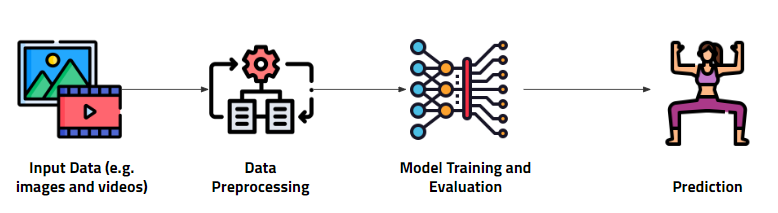
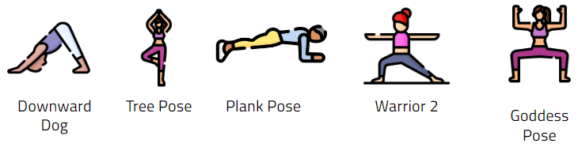

# 🧘Yoga Pose Image Classification with Pretrain Models

[](https://python.org)
[](https://www.tensorflow.org/)


This project is a small introduction to Computer Vision! In this example, we will re-train an pre-trained model to recognize yoga poses from image data. 

## 🛠️ Installation
Clone the GitHub repository to your local machine:
```
git clone https://github.com/vriveraq/Yoga-Pose-Image-Classification.git
```
Create an environment and install your requirements!


Clone the GitHub repository to your local machine:

```
pip install requirements.txt
```

## 👣 Pipeline
 </img>

We will follow the general machine learning workflow.

* Examine and understand the data
* Build an input pipeline, in this case using Keras ImageDataGenerator
* Compose the model
* Load in the pre-trained base model (and pre-trained weights)
* Stack the classification layers on top
* Train the model
* Evaluate model

## 📈 Data

Yoga is a very well-known practice to curb anxiety and relieve stress. There are many yoga poses but the very well-known ones are the downward dog pose, goddess pose, tree pose, plank pose and warrior pose. 

Computer Vision can be used to classify between them!


 </img>


**🔎 Caveat:** The dataset is divided into train and test subdirectories, with 5 subfolders in each directory corresponding to the 5 classes of yoga poses. The images are extracted from Bing using their API functionality so they may not be very accurate (watermarks, text may exist).

This dataset was obtained from [Kaggle](https://www.kaggle.com/datasets/niharika41298/yoga-poses-dataset).


## 🤳Model: VGG19

There are many pre-trained models for image classification! You can see a full list here: https://keras.io/api/applications/. We will use the VGG-19 model ([read more](https://keras.io/api/applications/vgg/#vgg19-function)).

## Notes:
* For image classification use cases, see this page for detailed [examples](https://keras.io/api/applications/#usage-examples-for-image-classification-models).

* For transfer learning use cases, make sure to read the guide to [transfer learning & fine-tuning](https://keras.io/guides/transfer_learning/).
### Model features:
* The default input size for this model is 224x224. 
* Each Keras Application expects a specific kind of input preprocessing. For VGG19, call `tf.keras.applications.vgg19.preprocess_input` on your inputs before passing them to the model. `vgg19.preprocess_input` will convert the input images from RGB to BGR, then will zero-center each color channel with respect to the ImageNet dataset, without scaling.


## 📚 Resources

You can follow this complete tutorial applied to a simpler scenario building a cat and dog classifier: [Tensorflow: Transfer learning and fine-tuning](https://www.tensorflow.org/tutorials/images/transfer_learning).


## 🌐 Contact details
Find this project interesting. Let's connect!
LinkedIn: [vriveraq](www.linkedin.com/in/vriveraq)
